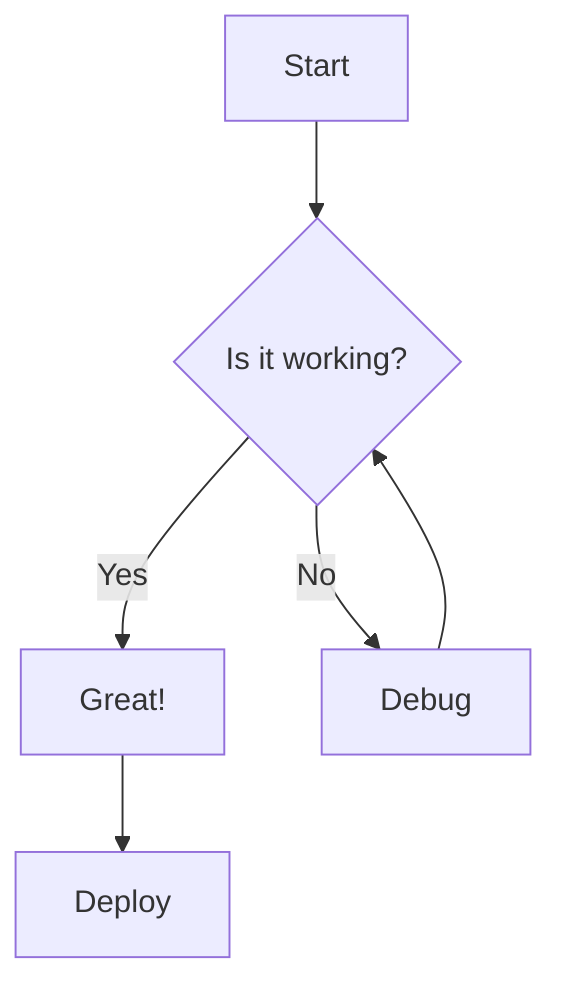
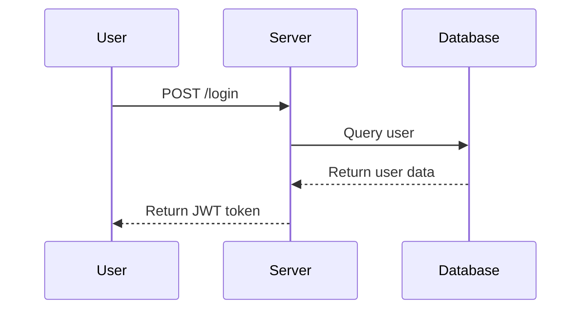
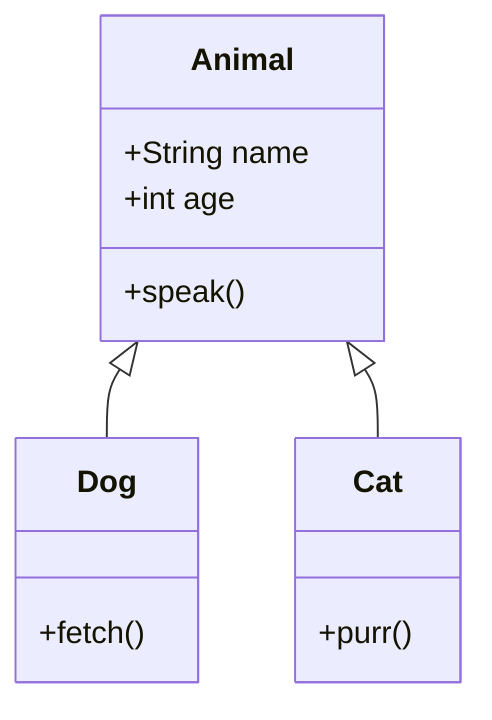
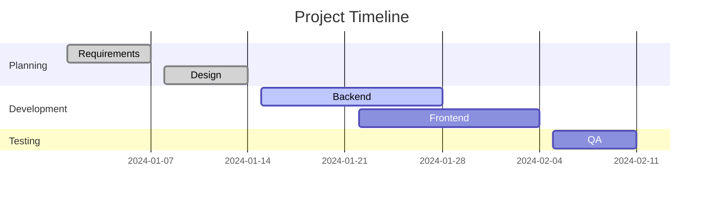
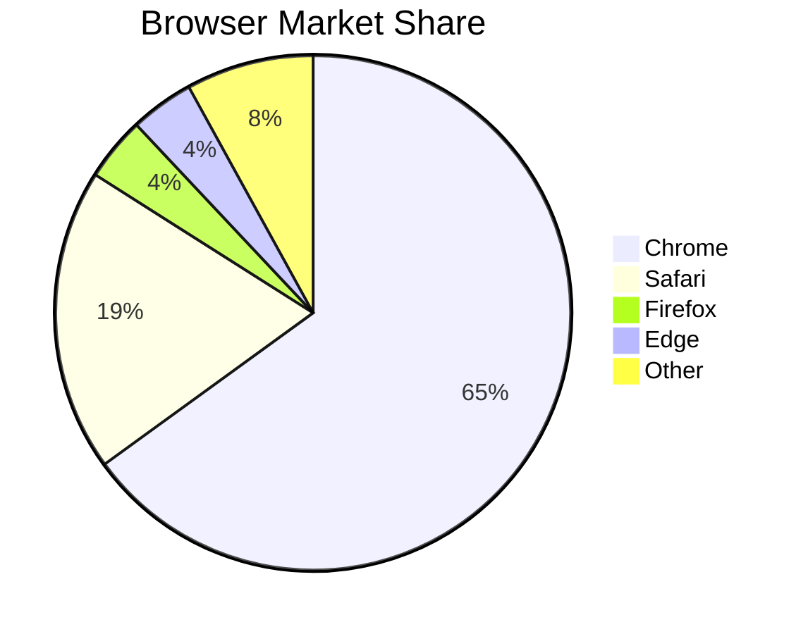

# GitHub Markdown — Complete Test Reference

> A comprehensive file covering every GitHub Flavored Markdown (GFM) feature for testing purposes.

---

## Table of Contents

- [Headings](#headings)
- [Text Formatting](#text-formatting)
- [Blockquotes](#blockquotes)
- [Lists](#lists)
- [Code](#code)
- [Links](#links)
- [Images](#images)
- [Tables](#tables)
- [Task Lists](#task-lists)
- [Footnotes](#footnotes)
- [Horizontal Rules](#horizontal-rules)
- [HTML in Markdown](#html-in-markdown)
- [Emoji](#emoji)
- [Mentions and References](#mentions-and-references)
- [Alerts / Callouts](#alerts--callouts)
- [Collapsed Sections](#collapsed-sections)
- [Math](#math)
- [Mermaid Diagrams](#mermaid-diagrams)
- [Keyboard Keys](#keyboard-keys)
- [Strikethrough and Highlights](#strikethrough-and-highlights)
- [Definition Lists](#definition-lists)
- [Escaping Characters](#escaping-characters)
- [Comments](#comments)

---

## Headings

# H1 — Top-Level Heading
## H2 — Section Heading
### H3 — Subsection Heading
#### H4 — Sub-subsection
##### H5 — Minor Heading
###### H6 — Smallest Heading

Alternate H1 (Setext style)
===========================

Alternate H2 (Setext style)
---------------------------

---

## Text Formatting

Normal paragraph text. Lorem ipsum dolor sit amet, consectetur adipiscing elit.

**Bold text using double asterisks**

__Bold text using double underscores__

*Italic text using single asterisk*

_Italic text using single underscore_

***Bold and Italic combined***

___Bold and Italic with underscores___

~~Strikethrough text~~

`Inline code`

> **Bold inside a blockquote**

This is a sentence with a line break at the end (two trailing spaces):  
This line follows immediately after the break.

This is a second paragraph separated by a blank line.

---

## Blockquotes

> Single-level blockquote.

> Multi-line blockquote.
> This is still part of the same quote.

> Nested blockquote level 1.
>
> > Nested blockquote level 2.
> >
> > > Nested blockquote level 3.

> Blockquote with **formatted** text, `inline code`, and a [link](https://github.com).

---

## Lists

### Unordered Lists

- Item A
- Item B
  - Nested item B1
  - Nested item B2
    - Deep nested B2a
- Item C

* Item using asterisk
* Another item

+ Item using plus
+ Another item

### Ordered Lists

1. First item
2. Second item
   1. Sub-item 2.1
   2. Sub-item 2.2
3. Third item

### Mixed Nested Lists

1. Step one
   - Detail A
   - Detail B
2. Step two
   - Detail C
     1. Sub-step C1
     2. Sub-step C2

### Loose Lists (paragraphs inside items)

- Item with a paragraph.

  This is an extra paragraph inside the list item.

- Another item with a paragraph.

  And its extra paragraph.

---

## Code

### Inline Code

Use `git status` to list changed files. Call `console.log("hello")` in JavaScript.

### Fenced Code Blocks

```
Plain fenced code block (no language)
```

```bash
# Bash example
echo "Hello, GitHub!"
git add .
git commit -m "Initial commit"
git push origin main
```

```python
# Python example
def greet(name: str) -> str:
    return f"Hello, {name}!"

print(greet("World"))
```

```javascript
// JavaScript example
const fetchData = async (url) => {
  const response = await fetch(url);
  const data = await response.json();
  return data;
};
```

```typescript
// TypeScript example
interface User {
  id: number;
  name: string;
  email?: string;
}

const getUser = (id: number): User => ({ id, name: "Alice" });
```

```json
{
  "name": "markdown-test",
  "version": "1.0.0",
  "dependencies": {
    "react": "^18.0.0"
  }
}
```

```yaml
# YAML example
name: CI Pipeline
on: [push, pull_request]
jobs:
  build:
    runs-on: ubuntu-latest
    steps:
      - uses: actions/checkout@v3
```

```sql
-- SQL example
SELECT u.id, u.name, COUNT(o.id) AS order_count
FROM users u
LEFT JOIN orders o ON u.id = o.user_id
WHERE u.active = TRUE
GROUP BY u.id, u.name
ORDER BY order_count DESC;
```

```html
<!-- HTML example -->
<!DOCTYPE html>
<html lang="en">
  <head>
    <meta charset="UTF-8" />
    <title>Test Page</title>
  </head>
  <body>
    <h1>Hello World</h1>
  </body>
</html>
```

```css
/* CSS example */
:root {
  --primary-color: #0366d6;
}

.button {
  background-color: var(--primary-color);
  border-radius: 4px;
  padding: 8px 16px;
}
```

### Indented Code Block (4 spaces)

    This is an indented code block.
    It preserves whitespace.
    No syntax highlighting here.

---

## Links

### Inline Links

[GitHub](https://github.com)

[GitHub with title](https://github.com "GitHub Homepage")

### Reference Links

[GitHub Reference][github-ref]

[Docs][docs]

[github-ref]: https://github.com
[docs]: https://docs.github.com "GitHub Docs"

### Autolinks

<https://github.com>

<email@example.com>

### Relative Links

[Go to Headings section](#headings)

[Link to a file](./README.md)

### Bare URLs (GFM auto-linking)

https://github.com

---

## Images

### Inline Image


### Reference Image

![Alt text][logo]

[logo]: https://github.githubassets.com/images/modules/logos_page/GitHub-Mark.png "Logo"

### Image with Link

[](https://github.com)

---

## Tables

### Basic Table

| Name    | Role       | Status  |
| ------- | ---------- | ------- |
| Alice   | Developer  | Active  |
| Bob     | Designer   | Active  |
| Charlie | Manager    | Inactive|

### Aligned Table

| Left-aligned | Center-aligned | Right-aligned |
| :----------- | :------------: | ------------: |
| Left         |    Center      |         Right |
| `code`       |   **bold**     |        *italic* |
| 100          |      200       |           300 |

### Table Without Alignment Markers

Name | Age | City
--- | --- | ---
Alice | 30 | New York
Bob | 25 | London

---

## Task Lists

- [x] Set up repository
- [x] Write README
- [ ] Add CI/CD pipeline
- [ ] Write unit tests
- [ ] Deploy to production

### Nested Task List

- [x] Frontend
  - [x] Design mockups
  - [x] Implement components
  - [ ] Write tests
- [ ] Backend
  - [x] Database schema
  - [ ] REST API
  - [ ] Authentication

---

## Footnotes

Here is a sentence with a footnote.[^1]

Another sentence with a second footnote.[^note]

Long footnote example.[^longnote]

[^1]: This is the first footnote.

[^note]: This is a named footnote.

[^longnote]: This is a longer footnote.

    It spans multiple paragraphs.
    Indent subsequent paragraphs with 4 spaces.

---

## Horizontal Rules

Three hyphens:

---

Three asterisks:

***

Three underscores:

___

---

## HTML in Markdown

<p>This is a raw HTML paragraph.</p>

<strong>Bold via HTML</strong> and <em>italic via HTML</em>.

<br>

<details>
  <summary>Click to expand (HTML details tag)</summary>
  This content is hidden by default.
</details>

<table>
  <tr>
    <th>HTML Table Header</th>
    <th>Column 2</th>
  </tr>
  <tr>
    <td>Row 1, Cell 1</td>
    <td>Row 1, Cell 2</td>
  </tr>
</table>

<kbd>Ctrl</kbd> + <kbd>C</kbd> using `<kbd>` tags.

---

## Emoji

Using emoji shortcodes:

:rocket: :tada: :white_check_mark: :x: :warning: :information_source:

:heart: :star: :fire: :bug: :construction: :lock:

:octocat: :computer: :book: :pencil: :gear: :sparkles:

Direct Unicode emoji: 🎉 ✅ ❌ 🔥 🚀 💡 🐛

---

## Mentions and References

> Note: These are syntax examples — they resolve only inside a real GitHub repository.

### User Mention

@octocat

### Team Mention

@org/team-name

### Issue / PR Reference

Fixes #42

Closes #100

See also: #15, #23

### Cross-repo Reference

github/linguist#1

### Commit Reference

Commit: `a5c3785ed8d6a35868bc169f07e40e889087fd2e`

Short SHA: `a5c3785`

---

## Alerts / Callouts

> [!NOTE]
> Useful information that users should know, even when skimming.

> [!TIP]
> Helpful advice for doing things better or more easily.

> [!IMPORTANT]
> Key information users need to know to achieve their goal.

> [!WARNING]
> Urgent info that needs immediate user attention to avoid problems.

> [!CAUTION]
> Advises about risks or negative outcomes of certain actions.

---

## Collapsed Sections

<details>
<summary>Click to expand — Basic collapsed section</summary>

This content is hidden until expanded.

- Item 1
- Item 2
- Item 3

</details>

<details>
<summary>Click to expand — Collapsed section with code</summary>

```python
def hidden_function():
    print("You found the hidden code!")
```

</details>

<details>
<summary>Click to expand — Nested collapsed sections</summary>

Outer content.

<details>
<summary>Inner collapsed section</summary>

Inner hidden content.

</details>

</details>

---

## Math

### Inline Math

The quadratic formula is $x = \frac{-b \pm \sqrt{b^2 - 4ac}}{2a}$.

Einstein's famous equation: $E = mc^2$.

### Block Math

$$
\int_{-\infty}^{\infty} e^{-x^2} dx = \sqrt{\pi}
$$

$$
\begin{pmatrix}
a & b \\
c & d
\end{pmatrix}
\begin{pmatrix}
x \\
y
\end{pmatrix}
=
\begin{pmatrix}
ax + by \\
cx + dy
\end{pmatrix}
$$

$$
\sum_{n=1}^{\infty} \frac{1}{n^2} = \frac{\pi^2}{6}
$$

---

## Mermaid Diagrams

### Flowchart



### Sequence Diagram



### Class Diagram



### Gantt Chart



### Pie Chart



---

## Keyboard Keys

Press <kbd>Ctrl</kbd> + <kbd>C</kbd> to copy.

Press <kbd>Cmd</kbd> + <kbd>Shift</kbd> + <kbd>P</kbd> to open the command palette.

Press <kbd>Esc</kbd> to cancel. Press <kbd>Enter</kbd> to confirm.

---

## Strikethrough and Highlights

~~This text is struck through.~~

~~Strikethrough with **bold** inside.~~

> ~~Strikethrough inside a blockquote.~~

---

## Escaping Characters

Escaped asterisk: \*not italic\*

Escaped backtick: \`not code\`

Escaped hash: \# Not a heading

Escaped brackets: \[not a link\]

Escaped backslash: \\

Full list of escapable characters:
\\ \` \* \_ \{ \} \[ \] \( \) \# \+ \- \. \!

---

## Comments

<!-- This is an HTML comment. It will NOT be rendered on GitHub. -->

Visible text before comment.
<!-- Hidden comment in the middle -->
Visible text after comment.

<!--
Multi-line comment:
Line 1
Line 2
Line 3
-->

---

## Miscellaneous Edge Cases

### Empty Table Cells

| A | B | C |
|---|---|---|
| 1 |   | 3 |
|   | 2 |   |

### Very Long Line

This is an extremely long line of text that just keeps going and going and going to test how GitHub renders long lines without any line breaks in the source markdown file and whether it wraps correctly.

### Unicode and Special Characters

Chinese: 你好世界

Arabic: مرحبا بالعالم

Japanese: こんにちは世界

Special: © ® ™ € £ ¥ § ¶ † ‡ • … ← → ↑ ↓ ↔

### Nested Formatting

***~~Bold, italic, and strikethrough~~***

`code with **asterisks** inside — not rendered`

> *Italic inside a blockquote with a **bold** word.*

### Code Block Inside Blockquote

> ```python
> def hello():
>     print("Hello from inside a blockquote!")
> ```

### List Inside Blockquote

> - Item 1
> - Item 2
>   - Nested item
> - Item 3

### Table Inside a Collapsed Section

<details>
<summary>Show data table</summary>

| ID | Name  | Score |
|----|-------|-------|
| 1  | Alice | 95    |
| 2  | Bob   | 87    |
| 3  | Carol | 92    |

</details>

---

*End of GitHub Markdown Test Reference* 🎉

---

> **File generated for testing purposes.**  
> Covers: headings, formatting, blockquotes, lists, code blocks, links, images, tables, task lists, footnotes, HR, HTML, emoji, mentions, alerts, collapsed sections, math, Mermaid diagrams, keyboard keys, escaping, comments, and edge cases.